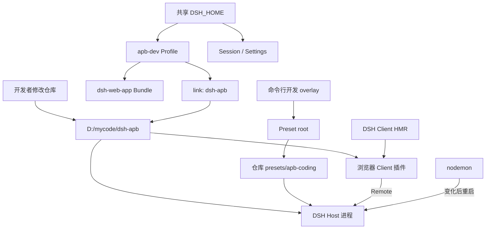
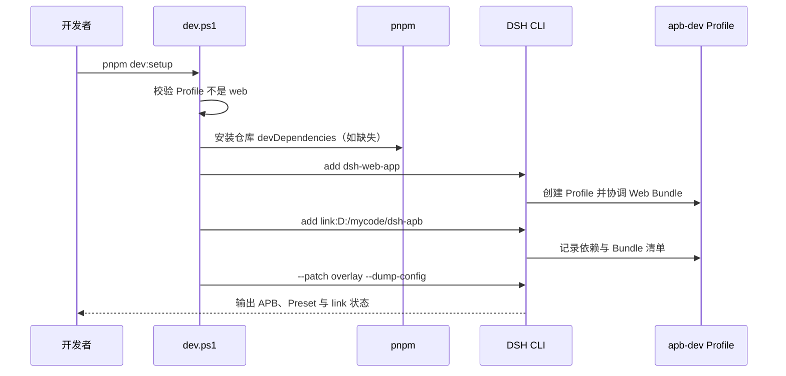
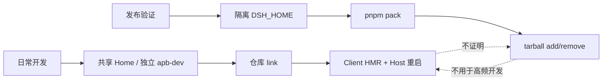

# APB 本地开发调试环境设计思路

## 1. 概述

本方案为 `dsh-apb` 提供一套长期使用的本地开发环境：在用户现有 `DSH_HOME` 中建立
独立 `apb-dev` Profile，使用 pnpm `link:` 让 Profile 直接加载 Git 仓库中的 APB
Bundle，并把 Preset 根目录指向仓库。Client 代码交给 DSH 内建 HMR 更新；Host、Bundle
patch 和 Preset 变化则重启完整 DSH Host 进程。Tarball 的打包安装仍保留为独立的发布
验证链路，不再承担日常开发职责。

设计基线是 DSH `0.1.1-rc.2`、pnpm `11.24.0` 和 Windows PowerShell。方案已经验证到
Profile 创建、Bundle/Preset 组合、Web 与 Client 资源加载、Client rebuilt 事件和 Host
自动重启；浏览器内部的 Client 卸载/重挂和 APB 权限完整 E2E 不属于本方案已证明的范围。

## 2. 设计目标与取舍

### 2.1 目标

- APB 不进入日常 `web` Profile，避免开发依赖和配置污染常用环境。
- Host、Client 和 Preset 都只维护仓库中的一份源码，不做复制同步。
- 修改 Client 后尽量不重启 Host；修改 Host 后保证状态和模块缓存被完整清空。
- 使用 DSH 的 Profile、Bundle、Preset roots 和 Client HMR 等正式能力，不修改生成配置。
- 日常开发与发布验证各自优化，不让 `pack/remove/add` 成为每次改代码的必经步骤。

### 2.2 为什么共享一个 DSH_HOME

`apb-dev` 与 `web` 的依赖清单、Bundle 组合和 Profile patch 相互独立，而 Session、Settings
等 Home 级数据可以共享。这符合当前开发需求：APB 只按 DSH 提供的能力开发，不需要每个
插件单独复制整套 Home 数据。

这不是强隔离。两个 Profile 如果同时操作同一 Session，会形成两个 Host 进程和两份内存
状态，因此约定同一 Session 只由一个正在运行的 Profile 使用。若未来要测试破坏性迁移、
不可信插件或全新用户环境，再使用单独 `DSH_HOME`。

### 2.3 为什么使用独立 Profile

Profile 是“本次启动采用哪些 Bundle”的清单，也是外部插件的依赖环境。创建
`apb-dev` 后，开发依赖只出现在：

```text
%USERPROFILE%\.dsh\profiles\apb-dev\
├─ package.json
├─ cordis.patch.yml
├─ pnpm-workspace.yaml
└─ node_modules\
```

脚本明确拒绝 `-Profile web`。这项保护比靠开发者记住“不装到 web”更可靠。

### 2.4 为什么 Bundle 使用 link

Profile 中记录：

```json
"@deepseek-ai/dsh-apb": "link:D:/mycode/dsh-apb"
```

其 `node_modules/@deepseek-ai/dsh-apb` 指向源码仓库。Host 和 Client 加载到的是当前工作树，
不需要每次修改后重新打包、卸载和安装。其他 Profile 若需要 APB，应自行声明其依赖，不应
链接 `apb-dev/node_modules`。

`link:` 只解决“代码从哪里读取”，不解决“运行中的模块何时重新加载”，所以它必须与
Client HMR 和 Host 进程监督配合。

### 2.5 为什么仓库安装 devDependencies

Node 默认根据链接的真实源码路径解析模块。APB 只有 `peerDependencies` 时，不能保证从
Profile 外侧找到 peers，曾经会出现 `ERR_MODULE_NOT_FOUND`。因此仓库同时安装与运行契约
对应的 `devDependencies`：

- `peerDependencies` 表达发布包对宿主的兼容范围；
- `devDependencies` 为链接源码、语法检查和本地运行提供可复现的解析环境；
- `pnpm-lock.yaml` 固定开发环境实际解析出的版本。

这不会把 devDependencies 装入 APB 发布 tarball。

### 2.6 为什么 Preset 使用 overlay

Preset 和 Bundle 是不同的生命周期对象。Bundle 通过 Profile 安装；Preset 由
`agent-presets` 服务从 roots 中发现。开发脚本设置：

```text
APB_DEV_PRESET_ROOT=D:\mycode\dsh-apb\presets
```

随后把 [apb-dev.patch.yml](../../scripts/apb-dev.patch.yml) 作为命令行 `--patch` 传给
DSH。这样 Preset 直接来自仓库，不复制到 `.agent-presets`，也不需要修改 Profile 中由
DSH 管理的文件。

配置覆盖会替换同一插件行的整个 `config`，不是深度合并单个字段。因此 overlay 必须同时
重述 `default`、`roots` 和 `includeUserRoot`，避免覆盖后丢失原配置。

### 2.7 为什么 Client HMR、Host 整进程重启

Client 是浏览器模块。DSH Web 已提供成熟的 Client HMR：发现最终 Client bundle 内容变化，
通过 `/plugins/events` 发送 `rebuilt`，浏览器失效旧模块并重新挂载。

Host 是有状态的 Node.js 服务。APB 当前把每个 Session 的模式保存在 Controller 的
`WeakMap`，并与权限状态联动。只替换某个 Host 模块可能丢失内存状态，却未重新触发完整的
Session 初始化。因此方案不启用实验性 Cordis Host HMR，而由 `nodemon` 重启整个 DSH
Host，使模块缓存、服务实例和组合配置一起重建。

## 3. 总体架构



结构中的三个独立选择维度是：

1. Profile 决定本次启动加载哪些 Bundle。
2. `link:` 决定 APB Bundle 的代码来源。
3. overlay 决定 `apb-coding` Preset 的发现来源。

它们缺一不可：只装 Bundle 看不到仓库 Preset，只配置 Preset 也不能提供 APB Host/Client。

## 4. 关键组件

| 组件 | 文件或位置 | 职责 |
| :--- | :--- | :--- |
| 开发入口 | `scripts/dev.ps1` | 执行 setup、status、start、clean 并保护 `web` Profile |
| Preset overlay | `scripts/apb-dev.patch.yml` | 把 Preset roots 指向仓库并保留用户根 |
| Bundle manifest | `package.json` | 声明 DSH Bundle、Client、Typert artifact、依赖和开发命令 |
| 依赖锁 | `pnpm-lock.yaml` | 固定链接开发所需依赖版本 |
| Bundle patch | `cordis.patch.yml` | 把 `apb-mode` Host 插件加入 Cordis 组合 |
| Host | `host/lib/index.js` | 权威模式、权限同步、命令和 Remote 实现 |
| Host Remote artifact | `host/lib/typert.host.js` | 由宿主 Typert Loader 注册的静态接口清单 |
| Client | `client/lib/client.js` | 模式 UI、快捷键和 Remote 调用 |
| Preset | `presets/apb-coding/` | APB persona、工具和 Agent 组合 |
| 包验证入口 | `scripts/verify-package.ps1` | 在隔离 Home 中验证 tarball 安装链路 |

## 5. 数据与控制流

### 5.1 首次准备



pnpm 11 如果首次阻止官方 Web Bundle 所需的 `koffi` 构建，脚本只定向执行
`pnpm approve-builds koffi`，随后重试 Web Bundle 安装；不会执行 `--all`。

### 5.2 开发启动与更新

1. `start` 先幂等执行环境准备和状态检查。
2. 脚本设置 `APB_DEV_PRESET_ROOT` 并以 overlay 启动指定 Profile。
3. `nodemon` 监视 `host/lib`、`cordis.patch.yml` 和 `presets`。
4. Client bundle 由 DSH 自己监视，故 `client/lib` 不加入 nodemon。
5. Client 变化产生 rebuilt 事件，不中断 Host。
6. Host/Preset/Bundle patch 变化结束旧 DSH 子进程并完整启动新进程。

### 5.3 清理

`clean` 只调用 DSH 插件命令，从开发 Profile 移除 `@deepseek-ai/dsh-apb`。它保留：

- `apb-dev` Profile 本身；
- `dsh-web-app`；
- 仓库和开发依赖；
- Home 级 Session、Settings 和用户 Preset。

这样清理是可恢复且边界明确的；重新执行 `pnpm dev:setup` 即可恢复 APB link。

## 6. 关键函数与方法

| 函数 | 文件 | 说明 |
| :--- | :--- | :--- |
| `Initialize-DevelopmentEnvironment` | `scripts/dev.ps1` | 幂等安装仓库依赖、Web Bundle 和 APB link |
| `Approve-KoffiBuildIfPending` | `scripts/dev.ps1` | 只在 pnpm 生成待决配置时批准 `koffi` |
| `Get-ProfileManifest` | `scripts/dev.ps1` | 安全读取目标 Profile manifest；不存在时返回空 |
| `Get-DependencySpec` | `scripts/dev.ps1` | 查询某个 Profile 依赖规范 |
| `Resolve-LinkTarget` | `scripts/dev.ps1` | 解析 APB 目录链接并验证它确实指向当前仓库 |
| `Show-DevelopmentStatus` | `scripts/dev.ps1` | 显示依赖、link、Preset root 并检查最终组合 |
| `Remove-DevelopmentLink` | `scripts/dev.ps1` | 只移除目标 Profile 中的 APB Bundle |

## 7. 配置与环境

| 配置 | 默认值 | 作用 |
| :--- | :--- | :--- |
| `DSH_HOME` | `%USERPROFILE%\.dsh` | Profile 与共享 Home 数据根目录 |
| `Profile` | `apb-dev` | 日常开发 Profile；`web` 被明确拒绝 |
| `Port` | `18081` | DSH Web 监听端口；`0` 表示自动选择 |
| `NoOpen` | false | 禁止脚本自动打开浏览器 |
| `APB_DEV_PRESET_ROOT` | `<仓库>\presets` | overlay 使用的 Preset 根目录 |
| Web Bundle 版本 | `0.1.1-rc.2` | 当前验证基线 |
| nodemon watch | `host/lib`、`cordis.patch.yml`、`presets` | 触发完整 Host 重启的范围 |
| nodemon extensions | `js,yml,yaml` | 参与重启判断的扩展名 |

## 8. 注意事项、错误路径与边界情况

1. **Profile 并不保存第二份源码。** 它保存依赖声明和链接入口；仓库仍是唯一源码。
2. **不要同时运行两个 Profile 操作同一 Session。** 磁盘数据共享，但 Host 内存状态不共享。
3. **不要手工编辑 Profile manifest 或生成的 Cordis 配置。** Bundle 清单由
   `dsh plugin` 协调，开发差异由命令行 overlay 提供。
4. **`package.json` 不在 nodemon 监视范围。** 修改 exports、dependencies 或 DSH
   manifest 后，应停止进程，执行 `pnpm install`、`pnpm dev:setup`，再启动。
5. **未来引入 `client/src` 时还需构建 watcher。** DSH HMR 只观察最终
   `client/lib/client.js`，不会替项目执行源码编译。
6. **Client rebuilt 事件不等于 UI 已完全恢复。** 插件应正确释放事件、样式和 Fiber；
   浏览器重挂行为仍应补自动化验收。
7. **Host 重启会清空 APB 瞬时模式。** 当前同一 Session 会回到 ask/read-only，这是已选择
   的安全语义，不应把它误判为状态丢失缺陷。
8. **开发启动不代替发布验收。** `link:` 会暴露未打包文件系统；只有 tarball 流程能检查
   `files` 清单和真正的 add/remove 行为。
9. **Remote 注册不得依赖链接包的模块私有状态。** Node 会从链接仓库和 DSH 安装目录加载
   不同的 `dsh-typert-protocol` 实例；APB 通过 `exports["./typert"]` 注册静态 artifact，
   避免装饰器 `WeakMap` 因模块实例不同而产生 404。

## 9. 扩展点

- 增加新的 Host 源目录时，同步扩展 `nodemon --watch`，并验证一次实际重启。
- 引入 Client 构建工具时，在 `pnpm dev` 前并行启动构建 watcher，但仍让 DSH Client HMR
  负责浏览器模块更新。
- 新增开发专属 Cordis 配置时，优先扩展 `apb-dev.patch.yml`，不要污染 Bundle 的发布
  patch；重述被覆盖插件的完整 config。
- 如果未来 DSH 提供正式 Preset 安装命令，应保留开发 roots 方案，同时把稳定 Profile 的
  Preset 生命周期迁移到官方机制。
- 若 Host 状态改为可重建且 Cordis Host HMR 得到官方验证，可单独评估 Host 真 HMR；在此
  之前不要把 Client HMR 的成熟度类推到 Host。

## 10. 方案边界图



两条链路互补：日常链路优化反馈速度和单一源码，发布链路验证包边界和安装生命周期。
