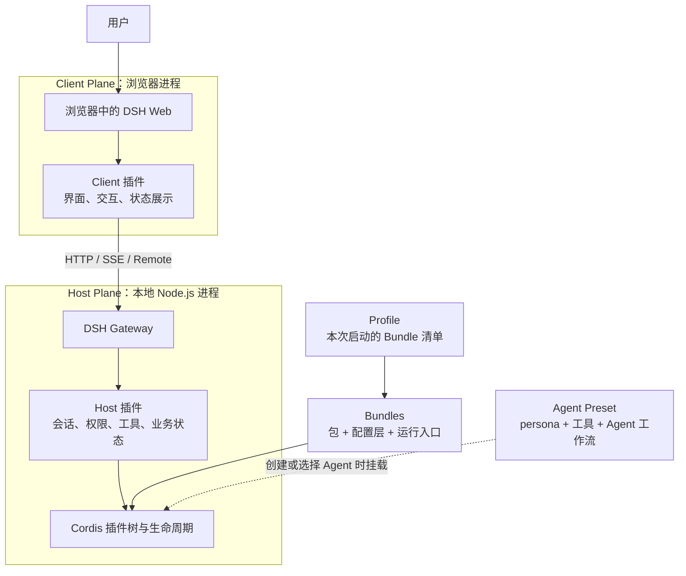
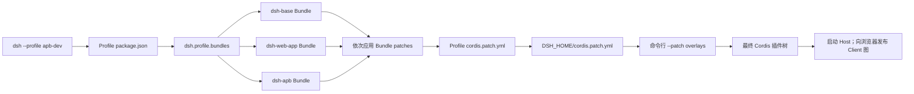
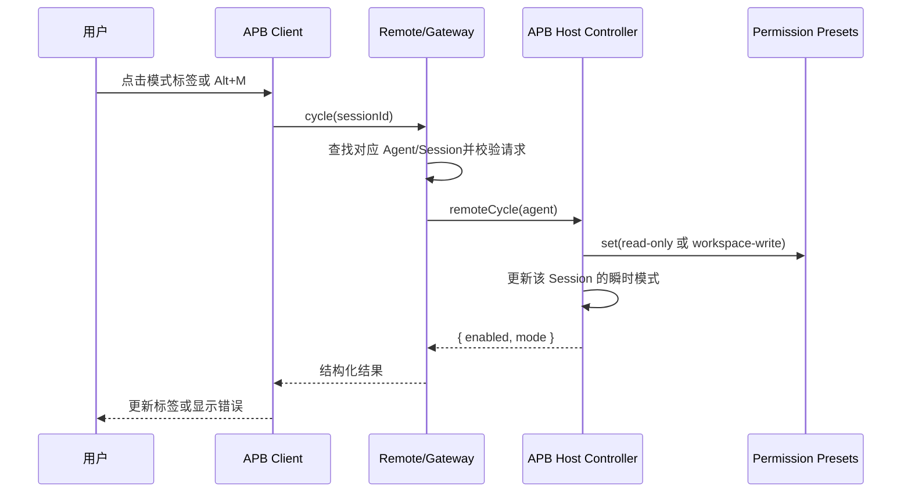
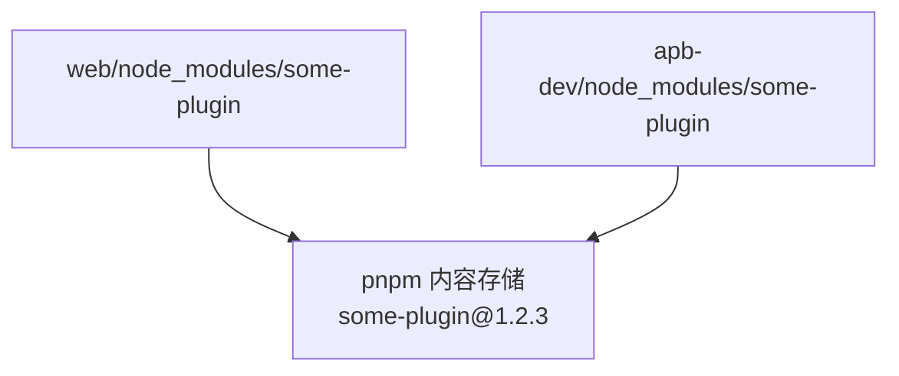
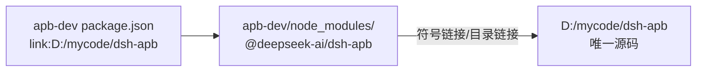
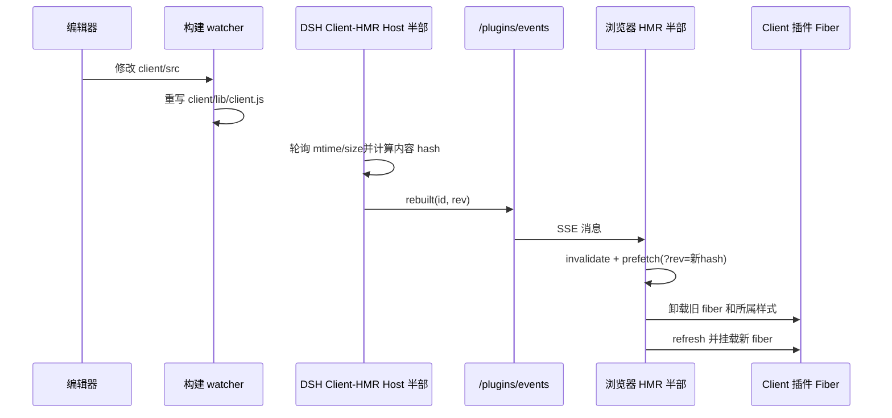
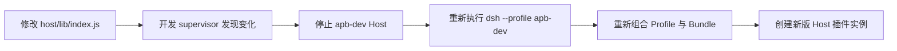
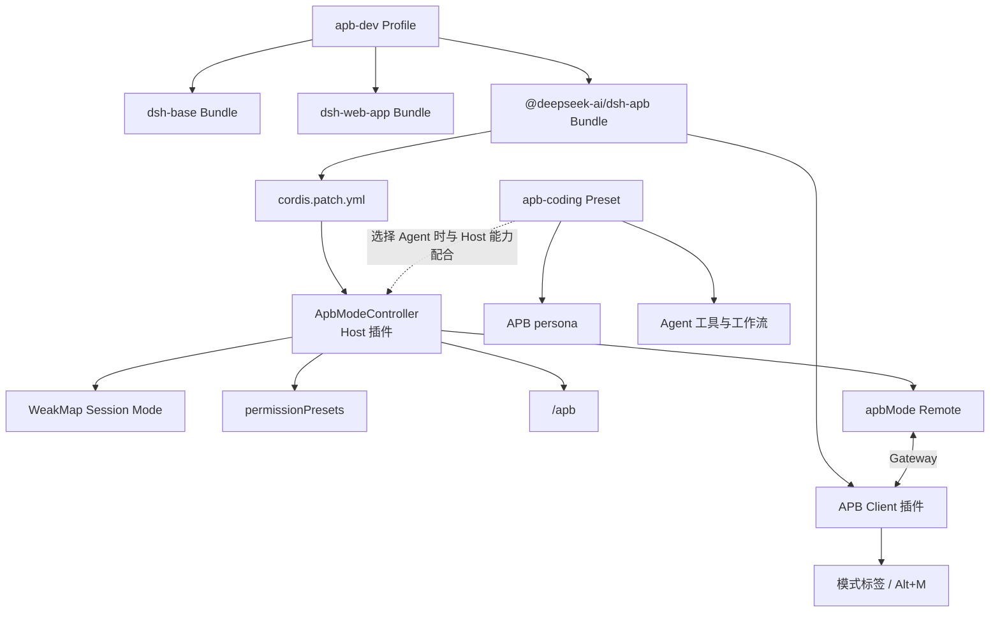

# DSH 插件架构与模块关系笔记

## 1. 概述

DSH（DeepSeek Harness）可以理解为一个由 Cordis 插件组装出来的 AI 应用。Profile 决定
一次启动选择哪些 Bundle；Bundle 是包含包清单、配置层和运行代码的安装与分发单元；
Bundle 的配置层再把真正运行的 Host 插件加入 Cordis 树。Web 场景还会把 Client 插件
交给浏览器运行，Client 通过 Remote 调用 Host。Agent Preset 则在创建 Agent 时决定
persona、工具和工作方式，它与 Profile Bundle 是相互配合但生命周期独立的对象。

本文从插件开发视角解释这些概念、它们之间的关系，以及 pnpm、`link:` 和热更新位于哪一层。
内容以本机 DSH `0.1.1-rc.2` 和当前 `dsh-apb` 仓库为观察基线；未经运行验证的开发方案会
明确标为“建议”或“待验证”。

## 2. 架构

### 2.1 总体结构



可以用下面一句话记住主线：

```text
Profile 选择 Bundle
Bundle 配置 Plugin
Plugin 运行在 Host 或 Client
Remote 连接 Client 与 Host
Preset 配置某一类 Agent
Cordis 管理所有插件的依赖、装载和卸载
```

### 2.2 启动与组装层级



配置层按先后顺序应用，后面的层可以覆盖前面的同 ID 行：

1. Profile 清单中的各个 Bundle patch。
2. 当前 Profile 的 `cordis.patch.yml`。
3. `$DSH_HOME/cordis.patch.yml`，它由同一 DSH_HOME 下的 Profile 共享。
4. 启动命令传入的 `--patch`。

一个重要细节是：后置 patch 替换某行的整个 `config`，不是只深度合并某一个字段。因此覆盖
配置时，需要重述该行仍然需要的全部配置。

## 3. 关键组件

| 组件 | 在哪里 | 职责 |
| :--- | :--- | :--- |
| Profile | `$DSH_HOME/profiles/<name>/` | 声明一次启动采用哪些 Bundle，并提供该 Profile 的依赖环境和后置配置 |
| Profile manifest | `profiles/<name>/package.json` | 保存 `dependencies` 和 `dsh.profile.bundles` |
| Profile patch | `profiles/<name>/cordis.patch.yml` | 覆盖或扩展该 Profile 的最终 Cordis 组合 |
| Bundle | 一个 npm 包，如 `@deepseek-ai/dsh-apb` | 承载包声明、Bundle patch、Host/Client 入口及发布边界 |
| Bundle manifest | 当前仓库 `package.json` | 声明包名、exports、`dsh.bundle`、`dsh.client` 和依赖 |
| Bundle patch | 当前仓库 `cordis.patch.yml` | 把 Bundle 提供的 Host 插件行插入 Cordis 树 |
| Host 插件 | 当前仓库 `host/lib/index.js` | 在 DSH Node.js 进程中运行，拥有权威业务状态和系统能力 |
| Client 插件 | 当前仓库 `client/lib/client.js` | 在浏览器中运行，负责界面、输入和结果展示 |
| Remote/Gateway | DSH Host 与 Client 基础设施 | 把 Host 方法映射为 Client 可调用的 RPC，并处理查找、校验和错误封装 |
| Agent Preset | 当前仓库 `presets/apb-coding/` | 决定 Agent 的 persona、工具和工作流组合 |
| Cordis | DSH 插件框架 | 处理插件依赖、服务、事件、effect、fiber 装载和卸载 |
| pnpm | 每个 Profile 的依赖管理器 | 安装包、复用内容存储、创建依赖入口或本地源码链接 |

### 3.1 Profile：清单加依赖环境

Profile 首先是一份组合清单，但它同时也是外部插件的依赖环境。典型目录如下：

```text
$DSH_HOME/profiles/apb-dev/
├─ package.json
├─ cordis.patch.yml
├─ pnpm-workspace.yaml
└─ node_modules/
```

Profile manifest 中的两部分回答不同问题：

```json
{
  "dependencies": {
    "@deepseek-ai/dsh-apb": "link:D:/mycode/dsh-apb"
  },
  "dsh": {
    "profile": {
      "bundles": [
        "@deepseek-ai/dsh-base",
        "@deepseek-ai/dsh-web-app",
        "@deepseek-ai/dsh-apb"
      ]
    }
  }
}
```

- `dependencies`：这个 Profile 从哪里取得某个包。
- `dsh.profile.bundles`：可访问的包中，哪些作为配置层加入本次启动。

Profile 之间不自动继承依赖。`web` 和 `apb-dev` 都需要某个外部插件时，应分别在两个
Profile 中声明安装，而不是让 `apb-dev` 链接 `web/node_modules`。

### 3.2 Bundle：安装、配置和分发单元

Bundle 不只是配置文件，也不是运行时插件实例。它是一整个功能包：

```text
@deepseek-ai/dsh-apb Bundle
├─ package.json             包、入口和 DSH manifest
├─ cordis.patch.yml         如何加入 Host 插件树
├─ host/lib/index.js        Host 运行代码
├─ host/lib/typert.host.js  Host Remote 静态接口清单
└─ client/lib/client.js     浏览器运行代码
```

一个 Bundle 可以挂一个插件，也可以挂一组插件：

```text
dsh-apb Bundle
└─ apb-mode Host 插件

dsh-web-app Bundle
├─ Web Server
├─ Client Modules
├─ Client HMR
├─ Gateway/Connection
└─ 多个 Web UI 插件
```

执行 `dsh plugin --profile <name> add <spec>` 时，DSH 先让 pnpm 增加依赖；如果包声明了
`dsh.bundle.patch`，DSH 再把真实包名加入该 Profile 的 Bundle 清单。

### 3.3 Host、Client 和 Remote

它们可以类比 Electron，但运行形态不同：

| DSH | Electron 类比 | 说明 |
| :--- | :--- | :--- |
| Host | Main process | 本地 Node.js 进程中的权威业务逻辑 |
| Client | Renderer | 普通浏览器中的界面和交互 |
| Remote | IPC/RPC 映射 | 跨进程调用、参数/返回值校验和错误传播 |

DSH 通常是“独立 Node.js Host + 普通浏览器”，而不是 Electron 的一体化桌面进程。

APB 的职责边界为：

```text
Client
├─ 显示 APB 模式
├─ 响应点击和 Alt+M
└─ 调用 Remote

Remote
├─ 将 sessionId 映射到 Host Agent
├─ 调用 Host 方法
└─ 返回结构化结果或错误

Host
├─ 保存权威模式
├─ 同步 permission preset
├─ 注册 /apb 命令
└─ 注入模型运行时上下文
```

### 3.4 Preset：Agent 配方，不是 Bundle

Preset 在创建或选择 Agent 时提供：

```text
persona
模型可见工具
Agent 工作流
按 Agent 作用域挂载的服务
```

APB 需要 Bundle 与 Preset 配合：

```text
APB Bundle
└─ 模式状态、权限控制、Remote 和 Client 按钮

apb-coding Preset
└─ Ask / Plan / Build 行为规则、persona 和工具组合
```

Bundle 安装成功不等于 Preset 已安装或已挂载。DSH `0.1.1-rc.2` 默认还会扫描
`$DSH_HOME/.agent-presets`，这是 DSH_HOME 级目录，不随 Profile 自动隔离。

## 4. 数据与控制流

### 4.1 一次 DSH Web 启动

1. 用户运行 `dsh --profile <name>`。
2. DSH 读取目标 Profile manifest。
3. 按 `dsh.profile.bundles` 顺序找到各 Bundle。
4. 读取并叠加 Bundle、Profile、Home 和命令行 patch。
5. Cordis 根据最终插件树和服务依赖启动 Host 插件。
6. Web Server 开始监听端口。
7. Client Modules 扫描启用行中声明 `dsh.client` 的包。
8. 浏览器取得 Client 模块图并下载相应 `client.js`。
9. 浏览器中的 Cordis Loader 挂载 Client 插件。
10. 创建或选择 Agent 时，再挂载对应 Preset。

### 4.2 APB 模式切换



Client 不是权限事实来源。只有 Host 成功改变模式和权限并返回后，Client 才更新显示。

### 4.3 pnpm 普通安装与本地 link

普通 registry 安装时，两个 Profile 分别有依赖记录，但 pnpm 通常复用底层内容：



本地开发链接则直接指向 Git 仓库：



`link:` 解决“DSH 最终读取哪份文件”；HMR或进程重启解决“运行中的代码什么时候重新加载”。

### 4.4 Client HMR



需要区分两件事：

- 构建 watcher 负责把源码变成 `lib/client.js`。
- DSH Client HMR 负责发现产物变化并替换浏览器插件。

当前仓库直接维护 `client/lib/client.js`，所以直接编辑该产物时不需要额外构建步骤；若以后
引入 `client/src`，则必须增加能持续生成 DSH Client bundle 的 watcher。

### 4.5 Host 更新

DSH 底层 Cordis 有 Host 模块 HMR能力，但本机版本的 Web Bundle 默认禁用了通用 Host
HMR，并注明 Web reload lifecycle 尚待验证。当前可靠链路是：



这不是 Client HMR：Client HMR 中虽然有一半监视逻辑运行在 Host 进程，但它只负责通知
浏览器替换 Client bundle，不会替换 `host/lib/index.js`。

## 5. 关键函数与方法

| 函数/方法 | 文件 | 说明 |
| :--- | :--- | :--- |
| `ApbModeController` | `host/lib/index.js` | APB Host 服务，保存进程内 Session 模式并提供命令和 Remote |
| `reset(session)` | `host/lib/index.js` | 把 APB Session 重置为 `ask` 并同步只读权限 |
| `set(agent, mode)` | `host/lib/index.js` | 校验模式、同步权限并更新权威瞬时状态 |
| `remoteGet(agent)` | `host/lib/index.js` | 返回 Client 所需的启用状态与当前模式 |
| `remoteCycle(agent)` | `host/lib/index.js` | 循环切换模式并返回 Host 权威结果 |
| `TYPERT` | `host/lib/typert.host.js` | 让宿主 Registry 注册 `apbMode/get\|cycle`，不依赖装饰器私有状态 |
| `apply(ctx)` | `client/lib/client.js` | 挂载 Client 插槽、Remote 描述符和 APB UI |
| `ApbModeChip` | `client/lib/client.js` | 展示模式、处理点击与快捷键、呈现 Remote 错误 |
| `foldPreset(events)` | `host/lib/index.js` | 从 Session 事件中折叠当前 Agent Preset |

通用 DSH 中还存在以下关键概念性入口：

| 入口 | 作用 |
| :--- | :--- |
| `dsh plugin --profile <name> ...` | 在目标 Profile 中转发 pnpm 命令并协调 Bundle 清单 |
| `dsh --profile <name>` | 组合并启动指定 Profile |
| `dsh --profile <name> --dump-config` | 输出最终组合，验证 Bundle/patch 是否真正生效 |
| `/plugins/<package>/client.js?rev=<hash>` | 浏览器取得某个 Client bundle 的地址 |
| `/plugins/events` | Client HMR 使用的 SSE 重建通知通道 |

## 6. 配置与环境

| 配置 | 来源 | 用途 |
| :--- | :--- | :--- |
| `DSH_HOME` | 环境变量；默认用户目录下 `.dsh` | Profile、Home patch、Settings、Preset 等数据根目录 |
| `dependencies` | Profile `package.json` | 目标 Profile 的外部包来源和版本/链接规范 |
| `dsh.profile.bundles` | Profile `package.json` | 本次 Profile 要应用的 Bundle 顺序 |
| `dsh.bundle.patch` | Bundle `package.json` | 指向 Bundle 的 Cordis patch |
| `dsh.client` | Bundle/插件 `package.json` | 声明浏览器 Client、平台和注入关系 |
| `exports["./client"]` | Bundle `package.json` | 指向实际提供给浏览器的 Client bundle |
| Profile patch | `profiles/<name>/cordis.patch.yml` | 当前 Profile 的后置覆盖层 |
| Home patch | `$DSH_HOME/cordis.patch.yml` | 同一 DSH_HOME 下所有 Profile 共享的后置层 |
| Agent Preset roots | DSH Preset 服务配置 | 决定从哪些目录发现 Preset |
| Client HMR poll interval | `dsh-client-hmr` 配置；默认约 500ms | Client bundle 文件变化检查间隔 |

## 7. 注意事项、陷阱与关键修复

1. **Profile 不是完整沙箱。** Profile 的依赖和 Bundle 清单彼此独立，但同一 DSH_HOME 下
   仍可能共享 Settings、Session 数据、Home patch 和默认用户 Preset 根。
2. **不要链接另一个 Profile 的 `node_modules`。** 两个 Profile 使用同一 registry 插件时，
   应分别声明同一包规范，让 pnpm 自己复用内容存储；本地 `link:` 应指向稳定源码仓库。
3. **`link:` 不等于热更新。** 文件入口会立即看到仓库内容，但 Node 已导入的 Host 模块仍
   受模块缓存影响。
4. **链接包有 peer dependency 边界。** Node 默认按符号链接的真实路径解析依赖，因此
   插件仓库应具有可复现的开发依赖，不能假定 Profile 的 peers 会自动从链接外侧解析。
   Remote 接口还必须通过 `./typert` artifact 或宿主的 `ctx.typert.register()` 注册，不能
   依赖链接包与 Host 恰好共享同一份模块私有标记表。
5. **Client HMR只监视最终产物。** 修改 `client/src` 而 watcher 没有重写
   `client/lib/client.js` 时，DSH 不会看到变化。
6. **Client HMR不是 React Refresh。** 热替换会创建新 Client fiber，插件内部临时 React
   状态会丢失；连接和未替换的数据服务可以继续存在。
7. **Host 真 HMR 对有状态服务有额外风险。** APB 的模式保存在 Controller 的 `WeakMap`；
   替换服务实例后，现有 Session 未必重新触发初始化，可能造成模式和权限暂时脱节。
8. **Bundle patch 与 Profile patch 的监视范围不同。** Profile/Home patch 支持运行时重组；
   不能据此推断链接仓库里的 Bundle patch 也会自动重新组合。
9. **Bundle 与 Preset 生命周期独立。** 安装或卸载 Bundle 不会天然安装或删除
   `$DSH_HOME/.agent-presets` 中的内容。
10. **两个 Profile 同时运行会有两个内存实例。** 即使磁盘包内容相同，两个 DSH Host
    进程中的服务对象、缓存和瞬时状态仍然独立。

## 8. 扩展点

### 8.1 开发新的 Host 能力

- 在 Bundle patch 中增加稳定 `id` 的 Host 插件行。
- 通过 `inject` 声明服务依赖。
- 将事件、注册和外部资源绑定到插件自己的 Cordis 上下文；外部资源使用 `ctx.effect()`
  返回清理函数。
- 修改后默认通过开发 Host supervisor 快速重启验证，不把 Web Host 真 HMR 作为既定能力。

### 8.2 开发新的 Client 能力

- 在 package manifest 中声明 `dsh.client` 和 `exports["./client"]`。
- 确保构建产物符合 DSH Client 模块格式。
- 所有事件监听器、插槽、样式和外部资源都必须随 Client fiber 卸载。
- 通过 `/plugins/events`、带 `rev` 的 bundle 请求和实际 UI 行为验证 HMR。

### 8.3 扩展 Remote

- Host 拥有业务事实和方法实现，Client 只消费映射后的接口。
- 改实现体时重新加载 Host；改变参数、返回值、命名空间或查找规则时，重新生成并验证
  Host/Client 两侧 Remote artifacts。
- 错误应跨 Gateway 保留可识别的结构和消息，Client 不应把所有错误吞成通用失败。

### 8.4 扩展 Profile 与 Preset

- Profile 通过标准 `dsh plugin --profile <name>` 管理外部 Bundle，不直接编辑其 manifest。
- Profile 专属差异放在 Profile patch；谨慎修改 Home patch，因为它影响同一 DSH_HOME 下
  的所有 Profile。
- Preset 扩展保持 Agent Plane 与 Host Plane 边界，验证其发现、选择、挂载和卸载行为。

## 9. 可视化流程

下面这张图汇总当前 APB 在 DSH 中的位置：



## 10. 开发刷新速查

| 修改对象 | 所在运行面 | 当前可靠的生效方式 |
| :--- | :--- | :--- |
| `client/lib/client.js` | 浏览器 Client | DSH Client HMR |
| 未来的 `client/src/*` | 构建输入 | watcher 先重写 `lib/client.js`，再由 Client HMR 接管 |
| `host/lib/index.js`、`host/lib/typert.host.js` | Node.js Host | nodemon 重启开发 Profile 的 DSH Host |
| Bundle `cordis.patch.yml` | 启动组装 | 重启 Host 并检查 `--dump-config` |
| Profile `cordis.patch.yml` | Profile 后置层 | 支持热重组；重要行为仍需重启回归 |
| `package.json` exports/dsh/dependencies | 安装和启动解析 | 协调依赖后重启 |
| Preset composition | Agent Plane | 新建/重新选择 Agent；权限相关修改建议重启验证 |

## 11. 参考资料

- [DSH 官方架构说明](https://github.com/deepseek-ai/deepseek-harness/blob/master/docs/architecture.md)
- [DSH 官方插件打包、Profile 与 Bundle 文档](https://github.com/deepseek-ai/deepseek-harness/blob/master/docs/user/develop/basic/publish.md)
- [DSH 官方 Cordis 组合与 HMR 教程](https://github.com/deepseek-ai/deepseek-harness/blob/master/docs/cordis-tutorial/06-composition-and-hmr.md)
- [DSH 官方 Client HMR 说明](https://github.com/deepseek-ai/deepseek-harness/blob/master/packages/client/hmr/README.md)
- [DSH 官方 Client HMR 实现](https://github.com/deepseek-ai/deepseek-harness/blob/master/packages/client/hmr/src/index.ts)
- [DSH 官方 Remote 与开发构建链路](https://github.com/deepseek-ai/deepseek-harness/blob/master/docs/api-gateway.md)
- [Node.js 符号链接模块解析说明](https://nodejs.org/download/release/v22.17.0/docs/api/cli.html#--preserve-symlinks)
