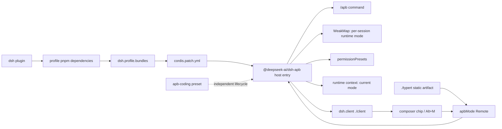
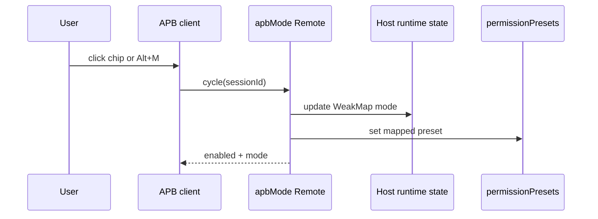

# 架构与运行链路

## 概览

dsh-apb 试图在 DSH 中提供 Ask / Plan / Build 三态工作流。仓库包含两个不同生命周期
的对象：profile bundle 负责 host/client 插件，agent preset 负责 persona 和工具组合。
当前单一发布包是 `@deepseek-ai/dsh-apb`，开发基线为 DSH `0.1.1-rc.2`。

## 总体架构

Bundle patch 当前把 host 入口插入 web profile；同一个包通过 `exports["./client"]`
和 `dsh.client` 暴露浏览器模块，并通过 `exports["./typert"]` 向 DSH Typert Loader
提供 Host Remote 静态接口清单。`presets/apb-coding` 位于用户 preset 发现目录，未纳入
`dsh plugin` 生命周期。

## 关键组件

| 组件 | 文件 | 职责 |
| --- | --- | --- |
| Bundle manifest | `package.json` | 声明包入口、client 入口、bundle patch 和依赖 |
| Bundle patch | `cordis.patch.yml` | 向 profile 插入 `@deepseek-ai/dsh-apb` |
| Host controller | `host/lib/index.js` | 瞬时模式、命令、Remote、runtime context 与权限写入 |
| Host Typert artifact | `host/lib/typert.host.js` | 注册 `apbMode/get\|cycle` 的严格参数与返回值描述 |
| Client module | `client/lib/client.js` | chip、Alt+M 和 `apbMode/get|cycle` 请求 |
| Agent preset | `presets/apb-coding/agent.cordis.yml` | persona、工具与 APB 工作流组合 |
| Preset metadata | `presets/apb-coding/preset.yml` | preset 名称和说明 |

## 数据与控制流

### 正常切换

`ask`、`plan` 映射到 `read-only`，`build` 映射到 `workspace-write`。模式保存在 Host
controller 的 `WeakMap<Session, Mode>` 中，只在当前进程和当前 Session 对象生命周期内
有效。它不写入 session log，也不参与历史投影或恢复。客户端首次渲染时调用
`apbMode/get`，点击或 Alt+M 调用 `apbMode/cycle`，每次都以 Host 返回值为准。

### 当前异常路径

- APB agent 在 `agent/session-start` 或运行中切入 preset 时重置为 `ask`，并在首轮模型
  执行前调用 `permissionPresets.set` 校准真实权限；恢复旧会话不会恢复上次按钮档位。
- 目标模式等于当前模式时，命令和服务方法仍会幂等同步目标权限。
- 用户从 DSH 原生权限控件改档时，不改变 APB runtime mode。
- 三种模式的长期定义固定在 preset persona 中；host 每次模型请求只通过 runtime
  context 注入“当前模式 + 当前行动目标”，模式切换不会修改 system prompt。
- DSH `dsh-base` 原始 bundle 虽声明 `plan-mode`、`tool-fs` 和 `tool-fs-search`，但
  `dsh-web-app` 的后置 patch 会在 Web Host 层禁用这些行；Agent preset 再按作用域
  提供模型可见的工具。
- client 会生成失败字符串，但组件不渲染该值；快捷键也未阻止重复 keydown 或并发请求。

## 关键函数与状态

| 符号 | 当前行为 |
| --- | --- |
| `foldPreset(events)` | 折叠最后一个 `agent-preset/selected` |
| `modeContext(mode)` | 生成 `Current APB mode` 及当前模式的简短行动目标 |
| `MODE_PERMISSION` | `ask/plan -> read-only`，`build -> workspace-write` |
| `/apb` handler | status 查询目标/有效权限；显式模式或 next 切换；每次显式选择都同步权限 |
| `ApbModeController.set` | 更新 WeakMap 中的模式并同步权限，不写 session event |
| `apbMode/get\|cycle` | 为客户端读取或切换 Host 瞬时状态，不产生命令历史 |
| `ApbModeChip` | 展示 Remote 返回模式；询问为蓝色带边框，规划为绿色，构建为橘黄色 |

## 配置与包管理

- 根 `package.json#dsh.bundle.patch` 指向 `cordis.patch.yml`。
- 根 `package.json#dsh.client` 声明 web 平台和 client 注入依赖。
- 根 `package.json#exports["./typert"]` 暴露静态 Host Remote 清单；注册不依赖
  `dsh-typert-protocol` 的模块私有状态，因此适用于仓库 `link:` 开发。
- `dsh plugin --profile <name>` 在目标 Profile 中调用 pnpm，并按已安装依赖重新协调
  `dsh.profile.bundles`。
- 源码目录安装会形成开发链接；tarball/registry 是可复现交付边界。
- preset 默认发现目录为 `$DSH_HOME/.agent-presets`，与 profile bundle 分离。

## 非显然行为

1. `ask` 是每次 APB Session 激活的运行时默认值；只校准为 `read-only`，不写初始化事件。
2. `/apb status` 同时显示目标权限和 `permissionPresets.current(events)` 得到的有效权限；
   外部权限变更后的自动纠正策略仍需继续定义。
3. client 是否显示由 `apbMode/get` 的 `enabled` 决定，不是 client 自己读取 preset 名称；按钮将
   ask/plan/build 显示为“询问/规划/构建”，协议和命令标识仍使用英文值。
4. Bundle 安装成功只证明 profile 层生效，不证明独立 preset 已安装或可挂载。

## 已知限制与修复方向

- host controller 由 profile bundle 只挂载一次；preset 只负责 agent-plane 组合，避免重复挂载。
- 为新建或恢复的 APB 会话初始化进程内 ask 状态并应用权限，且同模式命令也能执行幂等同步。
- 将有效权限纳入 status，定义原生权限控件修改后的协调策略。
- APB preset 内已不再挂载原生 plan，Web Host 层也已禁用 dsh-base 的 `plan-mode`；
  模式规则固定在 persona，当前模式由 runtime context 提供，仍需完成真实会话中的
  plan/确认/build 验收。
- UI 显示命令失败，并以 `event.repeat` 与同步锁阻止重复提交。

完整问题编号见[已知问题](../project/known-issues.md)。

## 扩展点

- 新增模式：同时调整 `MODES`、`MODE_PERMISSION`、runtime context、Remote 协议和 UI
  标签/颜色；模式是瞬时状态，不新增 session event 或 projection。
- 修改权限映射：优先改 `MODE_PERMISSION`，但必须同步状态一致性测试。
- 修改快捷键：调整 client 的 `HOTKEY`，并验证浏览器级冲突。
- 扩展 preset：保持 host-plane 与 agent-plane 服务边界；发布服务必须验证 isolate realm。
- 更换交付方式：不能绕过 `dsh.bundle.patch` 和 `dsh plugin` 的 profile 协调机制。
