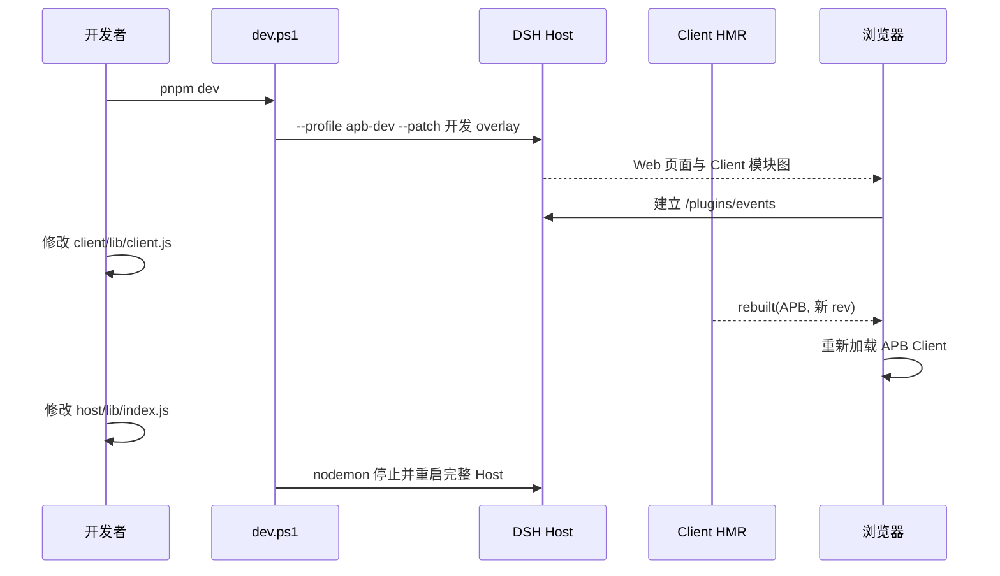
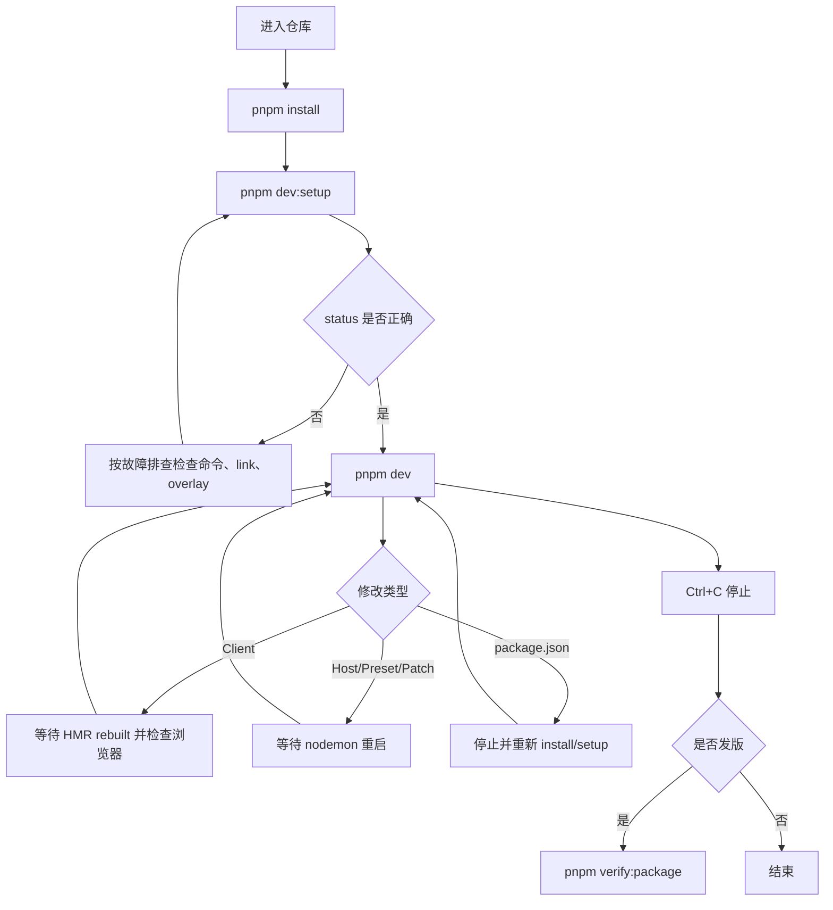

# APB 本地开发调试环境使用说明

## 1. 概述

本说明用于在 Windows 上准备和使用 `dsh-apb` 的日常开发环境。默认环境位于用户现有
`DSH_HOME`，使用独立 `apb-dev` Profile，不会把 APB 安装到 `web` Profile。完成首次准备
后，执行一条 `pnpm dev` 即可启动；Client 修改走 DSH HMR，Host、Bundle patch 和 Preset
修改会自动重启 DSH。

如果你想先理解为什么这样拆分，请阅读
[APB 本地开发调试环境设计思路](../architecture/apb-local-development-design.md)。

## 2. 使用前提

需要满足：

- Windows PowerShell 5.1 或 PowerShell 7；
- `dsh` 已安装并在 `PATH`；
- `pnpm` 已安装并在 `PATH`；
- 当前仓库为 `D:\mycode\dsh-apb`，或脚本位于其他仓库位置时从该仓库根目录运行；
- 默认端口 `18081` 未被占用，或者改用其他端口/端口 `0`。

检查命令：

```powershell
dsh --version
pnpm --version
```

当前已验证版本为 DSH `0.1.1-rc.2`、pnpm `11.24.0`。

## 3. 首次准备与启动

### 3.1 最短路径

```powershell
cd D:\mycode\dsh-apb
pnpm install
pnpm dev
```

`pnpm dev` 会先自动补齐缺失项，再启动 Web。正常情况下终端应显示：

```text
开发 Profile：apb-dev
Web 基础 bundle：0.1.1-rc.2
APB 依赖：link:D:/mycode/dsh-apb
APB link 目标：D:\mycode\dsh-apb
default: apb-coding
dsh web: http://127.0.0.1:18081
```

浏览器默认自动打开。停止服务按 `Ctrl+C`。

### 3.2 分步准备

希望先检查环境、不立即启动时：

```powershell
pnpm dev:setup
pnpm dev:status
```

`setup` 是幂等的：已经正确安装的 Web Bundle 和 APB link 不会反复安装。`status` 是只读
检查，输出 Profile 路径、依赖规范、实际 link 目标、Preset root 和最终组合中的 APB 行。

### 3.3 自定义启动

```powershell
# 不自动打开浏览器
.\scripts\dev.ps1 start -NoOpen

# 使用指定端口
.\scripts\dev.ps1 start -Port 18082 -NoOpen

# 让系统选择空闲端口
.\scripts\dev.ps1 start -Port 0 -NoOpen

# 使用另一个开发 Profile
.\scripts\dev.ps1 start -Profile apb-experiment -Port 18083
```

`-Profile web` 会被脚本拒绝，这是有意的安全边界。

## 4. 启动后会发生什么



开发 Profile 的核心清单位于：

```text
%USERPROFILE%\.dsh\profiles\apb-dev\package.json
```

它应包含：

```text
@deepseek-ai/dsh-web-app = 0.1.1-rc.2
@deepseek-ai/dsh-apb = link:D:/mycode/dsh-apb
```

不要手工编辑这份 manifest；由 `dsh plugin` 和开发脚本维护。

## 5. 不同修改如何生效

| 修改内容 | 生效方式 | 开发者操作 |
| :--- | :--- | :--- |
| `client/lib/client.js` | DSH Client HMR | 保存文件，观察浏览器和 `/plugins/events` |
| `host/lib/index.js`、`host/lib/typert.host.js` | nodemon 重启完整 Host | 保存文件，等待终端再次显示 `dsh web:` |
| `cordis.patch.yml` | nodemon 重启并重新组合 Bundle | 保存后检查终端；必要时运行 `pnpm dev:status` |
| `presets/**/*.yml` | nodemon 重启并重新发现 Preset | 保存后新建或重新选择 Agent 验证 |
| `scripts/apb-dev.patch.yml` | 当前未被 nodemon 监视 | 停止后重新执行 `pnpm dev` |
| `package.json` | 依赖/入口关系变化 | 停止，执行 `pnpm install` 和 `pnpm dev:setup`，再启动 |
| `pnpm-lock.yaml` | 开发依赖锁变化 | 重新执行 `pnpm install` 后启动 |

当前仓库直接维护 `client/lib/client.js`。未来如果改为编辑 `client/src`，还必须先启动能持续
生成 `client/lib/client.js` 的构建 watcher，否则 DSH HMR 看不到变化。

## 6. 常用命令

| 命令 | 是否修改环境 | 用途 |
| :--- | :---: | :--- |
| `pnpm dev` | 是 | 补齐环境并启动日常开发服务 |
| `pnpm dev:setup` | 是 | 安装开发依赖、Web Bundle 和 APB link |
| `pnpm dev:status` | 否 | 检查 Profile、link、Preset 和组合配置 |
| `.\scripts\dev.ps1 clean` | 是 | 只移除 `apb-dev` 中的 APB link |
| `pnpm verify:package` | 是 | 在隔离 Home 中打包、安装并启动发布包 |
| `.\scripts\verify-package.ps1 status` | 否 | 查看隔离 tarball 验证环境 |

### 6.1 检查最终组合

开发脚本已经封装了以下检查：

```powershell
$env:APB_DEV_PRESET_ROOT = 'D:\mycode\dsh-apb\presets'
dsh --profile apb-dev --patch .\scripts\apb-dev.patch.yml --dump-config
```

输出至少应出现：

```text
id: agent-presets
default: apb-coding
id: apb-mode
name: '@deepseek-ai/dsh-apb'
```

### 6.2 检查 Web 和 Client 模块

服务启动后可执行：

```powershell
Invoke-WebRequest -UseBasicParsing http://127.0.0.1:18081/
Invoke-WebRequest -UseBasicParsing `
  http://127.0.0.1:18081/plugins/@deepseek-ai/dsh-apb/client.js
```

两项都应返回 HTTP 200。若使用 `-Port 0`，请从终端输出取得实际端口。

## 7. 配置说明

| 参数或变量 | 示例 | 说明 |
| :--- | :--- | :--- |
| `-Action` | `start`、`setup`、`status`、`clean` | 选择脚本动作 |
| `-Profile` | `apb-dev` | 指定开发 Profile，不能是 `web` |
| `-Port` | `18081` 或 `0` | 固定端口或自动选择 |
| `-NoOpen` | 开关 | 不自动打开浏览器 |
| `DSH_HOME` | `C:\Users\DELL\.dsh` | 未设置时使用用户默认 Home |
| `APB_DEV_PRESET_ROOT` | 脚本自动设置 | 指向仓库 `presets`，通常不要手工维护 |

同一 `DSH_HOME` 下的 Profile 会共享 Session 和 Settings。开发时可以复用这些数据，但不要
让 `web` 和 `apb-dev` 同时进入并修改同一个 Session。

## 8. 故障排查与注意事项

### 8.1 找不到 dsh 或 pnpm

现象：脚本提示“在 PATH 中找不到必需命令”。

处理：先在当前 PowerShell 中分别执行 `dsh --version`、`pnpm --version`；确认版本管理器
或安装目录已经加入 `PATH`，然后重新打开终端。

### 8.2 首次安装提示 koffi 构建被阻止

pnpm 11 会拦截未批准的依赖构建。脚本会识别 DSH Web 产生的待决 `koffi` 项，只批准：

```powershell
pnpm approve-builds koffi
```

然后重试 Web Bundle 安装。脚本不会使用 `pnpm approve-builds --all`。如果被阻止的是其他
包，脚本会停止，应先确认依赖来源，不要无条件批准。

### 8.3 APB link 指向错误目录

运行：

```powershell
pnpm dev:status
```

检查 `APB 依赖` 是否为当前仓库的 `link:`，以及 `APB link 目标` 是否为实际仓库绝对路径。
不一致时重新执行 `pnpm dev:setup`。

### 8.4 Client 修改后没有更新

依次检查：

1. 修改的是否是最终产物 `client/lib/client.js`；
2. 浏览器 Network 中 `/plugins/events` 是否保持连接；
3. 是否收到 `{"type":"rebuilt","id":"@deepseek-ai/dsh-apb"}`；
4. `/plugins/@deepseek-ai/dsh-apb/client.js?rev=...` 是否返回新内容；
5. Browser Console 是否报告模块卸载或重新挂载错误。

不要通过重启 Host 掩盖 Client HMR 生命周期问题；需要分别确认 rebuilt 事件和浏览器重挂。

### 8.5 Host 修改后没有重启

终端应显示：

```text
[nodemon] restarting due to changes...
[nodemon] starting `dsh ...`
dsh web: http://127.0.0.1:<端口>
```

如果没有，确认修改文件位于 `host/lib`，扩展名是 `js`。新目录需要加入
`scripts/dev.ps1` 的 `--watch` 参数。

如果页面显示 `APB·错误` 且详情包含 `/api/apbMode/get: HTTP 404`，先确认当前包仍导出
`./typert`，且 `host/lib/typert.host.js` 能被加载。日常调试应继续使用仓库 `link:`；不需要
通过反复打包安装来规避这个错误。

### 8.6 端口被占用

改用其他固定端口或自动端口：

```powershell
.\scripts\dev.ps1 start -Port 18082 -NoOpen
.\scripts\dev.ps1 start -Port 0 -NoOpen
```

### 8.7 Host 重启后模式回到 ask

这是当前设计语义。APB 模式保存在 Host 进程内，重启后同一 Session 回到
`ask/read-only`，避免恢复出与有效权限不一致的旧模式。

## 9. 清理、恢复与发布验证

### 9.1 移除开发 link

```powershell
.\scripts\dev.ps1 clean
```

该命令只从目标 Profile 移除 `@deepseek-ai/dsh-apb`。它不会删除 Web Bundle、Profile、
Session、Settings、仓库或 `node_modules`。恢复时执行：

```powershell
pnpm dev:setup
```

### 9.2 验证发布包

日常开发通过不代表 tarball 正确。准备发版时执行：

```powershell
pnpm verify:package
```

该流程使用仓库 `.debug/dsh-home`，重新 `pnpm pack`、安装 tarball、复制 Preset 并启动隔离
Web。修改源码后需要重新运行，因为这条链路验证的是一个静态打包快照。

### 9.3 当前验收边界

已通过：

- PowerShell 5.1 与 7 脚本语法；
- Profile 初始化和重复 setup；
- APB link 与 Preset 组合；
- Web 根页面和 APB Client 模块 HTTP 200；
- Client rebuilt SSE 事件；
- Host 文件变化后的完整进程重启；
- `link:` 环境中的 `apbMode/get` Host Remote 路由注册与完整 RPC 请求；
- 浏览器新会话页不再出现 `APB·错误`，控制台无新增错误；
- `web` Profile manifest 前后未变化。

未执行或未完全覆盖：

- 浏览器内部 Client Fiber 的卸载与重新挂载自动断言；
- Ask/Plan/Build 权限和沙箱拒写完整 E2E；
- Alt+M、失败提示、fork 的自动化验收。

这些范围不能仅凭启动成功或 UI chip 出现就宣称通过。

## 10. 操作流程图


